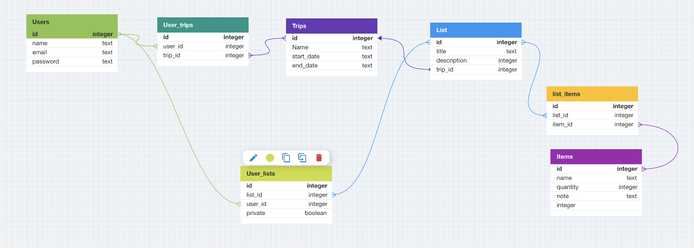

<a name="readme-top"></a>

<br />
<div align="center">

<h3 align="center">PACD</h3>

  <p align="center">
    An app to help you and your crew get everything PACD for your next adventure!
  </p>
</div>


<!-- TABLE OF CONTENTS -->
<details>
  <summary>Table of Contents</summary>
  <ol>
    <li>
      <a href="#about-the-project">About The Project</a>
      <ul>
        <li><a href="#built-with">Built With</a></li>
      </ul>
    </li>
    <li>
      <a href="#getting-started">Getting Started</a>
      <ul>
        <li><a href="#installation">Installation</a></li>
        <li><a href="#testing-with-rspec">Testing With RSpec</a></li>
      </ul>
    </li>
    <li><a href="#available-endpoints">Available Endpoints</a></li>
    <li><a href="#goals">Goals</a></li>
  </ol>
</details>


<br>

<!-- ABOUT THE PROJECT -->
## About The Project
<br>

<p align="right">(<a href="#readme-top">back to top</a>)</p>

### Built With:
  <p>
  
  </p>

**3.1.1**

  <p>
  
  </p>

**7.0.4**

  <p>
  
  </p>

**Postgres 14**


<p align="right">(<a href="#readme-top">back to top</a>)</p>

<!-- GETTING STARTED -->
## Getting Started

To run the application locally, this repository will need to be cloned and set up fully with required gems.

<br>

### Installation

1. Clone the repo:
   ```bash
   git@github.com:jadekstewart3/PACD_BE.git
   ```

2. Install gems:
   ```bash
   bundle install
   ```

3. To establish the database, run:
   ```bash
   rails db:create
   ```

4. To migrate the database configurations into your local development and test environment, run:
   ```bash
   rails db:migrate
   ```
<br>

  Inspect the `/db/schema.rb` and compare to the 'Schema' section below to ensure this migration has been done successfully.

<p align="right">(<a href="#readme-top">back to top</a>)</p>

<br>


### Testing with RSpec

Once `PACD_BE` is correctly installed, run tests locally to ensure the repository works as intended.

<br>

  To test the entire RSpec suite, run:
   ```bash
   bundle exec rspec
   ```

<br>

All tests should be passing if the installation was successful.

If any tests are not passing, please report which tests are not passing <a href="https://github.com/jadekstewart3/PACD_BE/issues">Here</a>.


<p align="right">(<a href="#readme-top">back to top</a>)</p>

<br>


## Available Endpoints
- This API can be called locally using a program like [Postman](https://www.postman.com).

- *Note:* Necessary parameters marked with {}

<br>

## Register A New User (Happy Path)

```http
POST /api/v1/users
```

<br>

Parameters: <br>
```json
{
	"name": "Antonio King Hung",
	"email": "tesseractcode@icloud.com",
	"password": "Password123"
}

```

| Code | Description |
| :--- | :--- |
| 201 | `Created` |

Response body:

```json

{
	"data": {
		"id": "1",
		"type": "user",
		"attributes": {
			"name": "Antonio King Hunt",
			"email": "tesseractcode@icloud.com",
			"trips": []
		},
	},
}
```
Notes:

<p align="right">(<a href="#readme-top">back to top</a>)</p>


## Goals


<br>

### Goals Checklist


<p align="right">(<a href="#readme-top">back to top</a>)</p>

<br>

## Database Schema



<br>

## Contributors
<table>
  <tr>
    <th>Jade Stewart</th>
    <th>Chris Crane</th>
    <th>Antonio King Hunt</th>
  </tr>

<tr>
  <td></td>
  <td></td>
  <td></td>
</tr>


  <tr>
    <td>
      <a href="https://github.com/jadekstewart3" rel="nofollow noreferrer">
         Github
      </a>
      <br>
      <a href="https://www.linkedin.com/in/jadestewart-software-engineer/" rel="nofollow noreferrer">
         LinkedIn
      </a>
    </td>
    <td>
      <a href="https://github.com/GreenGogh47" rel="nofollow noreferrer">
         Github
      </a>
      <br>
      <a href="https://www.linkedin.com/in/chrisjcrane/" rel="nofollow noreferrer">
         LinkedIn
      </a>
    </td>
    <td>
      <a href="https://github.com/4D-Coder" rel="nofollow noreferrer">
         Github
      </a>
      <br>
      <a href="https://www.linkedin.com/in/antoniokinghunt-4d-coder/" rel="nofollow noreferrer">
         LinkedIn
      </a>
    </td>
  </tr>
</table>
